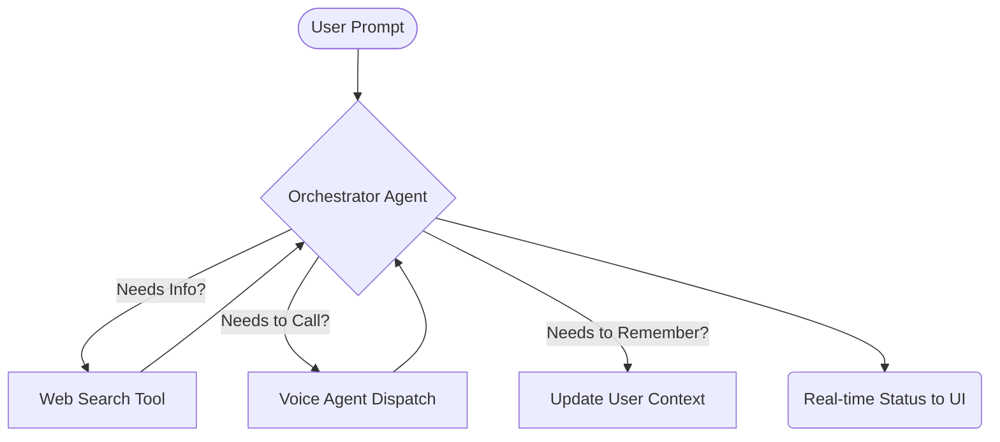
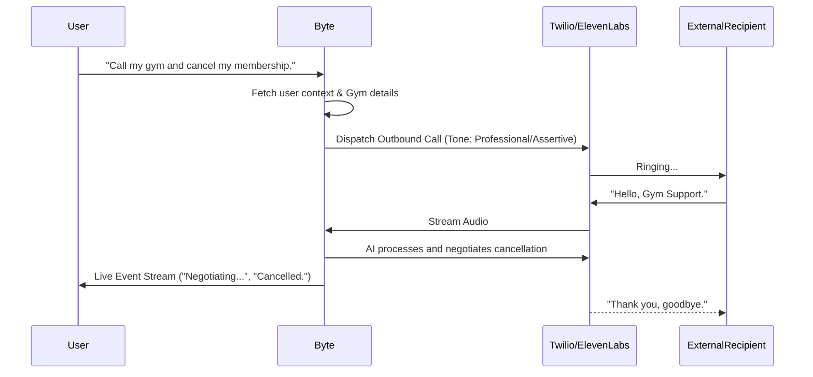

<div align="center">
  <h1>🤖 Byte AI</h1>
  <p><h3><strong>Your autonomous, personal AI agent. Tell it what to do — it gets it done.</strong></h3></p>
  <p>
    <i>Byte AI dynamically handles complex tasks including real-world voice calls, deep web research, and personal scheduling. Built using a modern React 19 + Node.js stack with Gemini & ElevenLabs integration.</i>
  </p>
</div>

<br />

## 🌟 Key Features

*   **🗣️ Voice Execution:** Dispatches AI agents to handle real-world phone calls (bookings, inquiries, negotiations) via Twilio and ElevenLabs.
*   **🧠 Intelligent Orchestration:** Dynamically combines web search and task execution based on user intent.
*   **🛡️ Social Interaction Buffer:** Intentionally handles anxiety-inducing, human-facing tasks (like calling customer service) to act as a buffer for introverted users or those facing social exhaustion.
*   **🎯 Contextual Personalization:** Maintains a persistent memory that adapts to user preferences and past interactions for highly tailored execution.

---

## 🏗️ High-Level Architecture
*(Insert High-Level Architecture Diagram Here)*

---

## 📊 Feature Workflows

### 1. The Autonomous Orchestration Flow
Byte breaks down complex prompts into step-by-step actions, orchestrating the right tools for the job.



### 2. Social Friction Buffer: The Call Execution Pattern
How Byte handles nerve-wracking phone calls on your behalf.



---

## 🛠️ Tech Stack

**Frontend:** React 19, Vite, Tailwind CSS 4, HeroUI, Zustand  
**Backend:** Node.js, Express, TypeScript, Zod  
**AI/Voice Engine:** Google Gemini, Groq, ElevenLabs, Twilio  
**Real-time & DB:** WebSockets (Socket.io), MongoDB + Mongoose  

---

## 🚀 Setup & Installation

### Prerequisites
- [Node.js](https://nodejs.org/en/) (v22+)
- [MongoDB](https://www.mongodb.com/) (running locally or a connection string)
- API Keys: Google Gemini, ElevenLabs, Twilio, Serper (Search API)

### 1. Clone & Install Dependencies
From the root directory:

```bash
# Install frontend dependencies
cd frontend
npm install

# Install backend dependencies
cd ../server
npm install
```

### 2. Environment Configuration

Copy the example environment file in the `server` directory and fill in your API keys:

```bash
cd server
cp .env.example .env
```

Your `.env` should look something like this:
```env
PORT=3001
JWT_SECRET=your_super_secret_jwt_key

GEMINI_API_KEY=your_gemini_api_key

# Database Connections
SPACETIMEDB_HOST=localhost:3000
SPACETIMEDB_MODULE=byte-dev

# Telephony integration
TWILIO_ACCOUNT_SID=ACxxxxxxxxxxxxxxxx
TWILIO_AUTH_TOKEN=your_twilio_auth_token
TWILIO_PHONE_NUMBER=+1xxxxxxxxxx

# Voice Model
ELEVENLABS_API_KEY=your_elevenlabs_api_key
ELEVENLABS_AGENT_ID=your_elevenlabs_agent_id

# Web search capabilities
SEARCH_API_KEY=your_serper_dev_api_key

# Required for webhooks (Twilio callback)
SERVER_BASE_URL=https://your-ngrok-url.ngrok.io
```

### 3. Run the Application

Start both the backend server and the frontend client simultaneously.

```bash
# Terminal 1: Backend
cd server
npm run dev

# Terminal 2: Frontend
cd frontend
npm run dev
```

Open your browser and navigate to [http://localhost:5173](http://localhost:5173).

---

## 💡 Usage

1. **Sign In / Create Account**: Establish your secure local profile.
2. **Setup Preferences**: Personalize the bot with your preferred tones, default payment info context, etc.
3. **Execute Prompts**: Use the dynamic interface to issue complex multi-step commands. Just tell it what you need to accomplish, and watch the real-time execution log!
